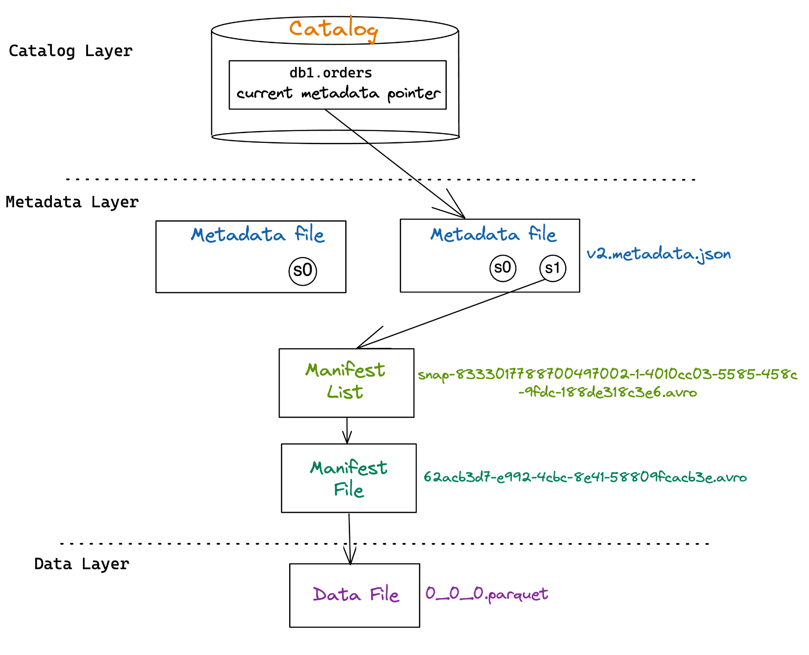

# Explore Apache Iceberg

## Table of Contents

- [Explore Apache Iceberg](#explore-apache-iceberg)
  - [Table of Contents](#table-of-contents)
  - [1. Introduction to Apache Iceberg](#1-introduction-to-apache-iceberg)
    - [How Did We Get Here? A Brief History](#how-did-we-get-here-a-brief-history)
      - [Foundational Components of a System Designed for OLAP Workloads](#foundational-components-of-a-system-designed-for-olap-workloads)
      - [Bringing It All Together](#bringing-it-all-together)
    - [Data Warehouse](#data-warehouse)
      - [Pros and Cons of a Data Warehouse](#pros-and-cons-of-a-data-warehouse)
    - [Data Lake](#data-lake)
      - [Pros and Cons of a Data Lake](#pros-and-cons-of-a-data-lake)
      - [Should I Run Analytics on the Data Lake or Data Warehouse?](#should-i-run-analytics-on-the-data-lake-or-data-warehouse)
    - [Enter Data Lakehouse](#enter-data-lakehouse)
    - [What is Apache Iceberg?](#what-is-apache-iceberg)
  - [2. Architecture of Apache Iceberg](#2-architecture-of-apache-iceberg)
    - [Data Layer](#data-layer)
    - [Metadata Layer](#metadata-layer)
    - [Iceberg Catalog](#iceberg-catalog)
  - [3. Apache Iceberg Features](#3-apache-iceberg-features)
    - [ACID Transactions](#acid-transactions)
    - [Partition Evolution](#partition-evolution)
    - [Hidden Partitioning](#hidden-partitioning)
    - [Row-Level Table Operations](#row-level-table-operations)
    - [Time-Travel](#time-travel)
    - [Version Rollback](#version-rollback)
    - [Scheme Evolution](#scheme-evolution)
  - [4. Getting Hands-On with Apache Iceberg](#4-getting-hands-on-with-apache-iceberg)
    - [4.1. Setting Up the Environment](#41-setting-up-the-environment)
    - [4.2. Lifecycle of Write and Read Queries](#42-lifecycle-of-write-and-read-queries)
      - [4.2.1. Write Queries in Apache Iceberg](#421-write-queries-in-apache-iceberg)
        - [Create Table](#create-table)
          - [Send Query to the Engine](#send-query-to-the-engine)
          - [Write Metadata File](#write-metadata-file)
          - [Update the Catalog File to Commit Changes](#update-the-catalog-file-to-commit-changes)
        - [Insert Query](#insert-query)
          - [Send Query to the Engine](#send-query-to-the-engine-1)
          - [Check the Catalog](#check-the-catalog)
          - [Write Data \& Metadata Files](#write-data--metadata-files)
          - [Update the Catalog File to Commit Changes](#update-the-catalog-file-to-commit-changes-1)
        - [MERGE Query](#merge-query)
      - [4.2.2. Read Queries in Apache Iceberg](#422-read-queries-in-apache-iceberg)
        - [SELECT Query](#select-query)
          - [Send Query to the Engine](#send-query-to-the-engine-2)
          - [Check the Catalog](#check-the-catalog-1)
          - [Get Information from the Metadata File](#get-information-from-the-metadata-file)
          - [Get Information from the Manifest List](#get-information-from-the-manifest-list)
          - [Get Information from the Manifest Files](#get-information-from-the-manifest-files)
        - [Time-travel Query](#time-travel-query)
  - [5. Optimizing the Performance of Iceberg Tables](#5-optimizing-the-performance-of-iceberg-tables)
    - [5.1. Compaction](#51-compaction)
    - [5.2. Sorting](#52-sorting)
    - [5.3. Partitioning](#53-partitioning)
    - [5.4. Copy-on-Write vs. Merge-on-read](#54-copy-on-write-vs-merge-on-read)
    - [5.5. Other Considerations](#55-other-considerations)

## 1. Introduction to Apache Iceberg

Data is a primary asset for organizations to make critical business decisions. Whether it is analyzing historical trends of the annual sales of a product or making predictions about future opportunities, data shapes the direction for organizations to make reliable choices. Further, in today’s day and age, data isn’t just nice-to-have, but a requirement for not only winning in the market, but even competing at all. With such a massive demand for information, there has been an enormous effort to accumulate data generated by the various systems within an organization to derive insights.

At the same time, the rate at which the various operational and analytical systems have been generating data has also skyrocketed. While more data has presented enterprises the opportunity to make better-informed decisions, there is also a dire need to have a platform that allows storing and analyzing all of this data so it can be used to build analytical products such as Business Intelligence (BI) reports and machine learning models to support decision making. This chapter will walk us through the history and evolution of data platforms from a practical point of view and present the benefits of a lakehouse architecture with open table formats like Apache Iceberg.

### How Did We Get Here? A Brief History

In terms of storage and processing systems, relational databases (RDBMS) have long been a standard option for organizations to keep a record of all of their transactional data. For example, if you are a transportation company, you would like to maintain information about any new bookings made by a customer. This new booking would be a new row in a relational database system. Information like this can support the day-to-day operations of a business. RDBMS systems used for these purposes support a specific data processing category called Online Transaction Processing (OLTP). Examples of these OLTP-optimized RDBMS systems are PostgreSQL, MySQL, and Microsoft SQL Server. These OLTP systems are designed and optimized for interacting with one or a few rows at a time very quickly. However, for the example above, if you want to understand the average profit made on all of the new bookings for the last quarter, using the data stored in an OLTP-optimized RDBMS will lead to significant performance problems when your data gets large enough.

Now, imagine that your organization has a large number of operational systems. These systems generate a vast amount of data. Your analytics teams’ goal is to build dashboards that rely on aggregations of the data from these different data sources (application databases). Unfortunately, OLTP systems are not designed to deal with such complex aggregate queries involving a large number of historical records. These workloads are known as Online Analytical Processing (OLAP) workloads. To address these limitations, a different kind of system optimized for OLAP workloads was needed.

#### Foundational Components of a System Designed for OLAP Workloads

A system designed for OLAP workloads is composed of a set of technological components that enable supporting modern-day analytical workloads.


*Figure 1-1. Technical components for analytical workloads*

***Storage***

To analyze historical data coming in from a variety of sources, you need to have a system that allows you to store such huge amounts of data. Therefore, storage is the first component we would need in a system that can deal with analytical queries on large datasets. There are a few options for storage, such as a local file system on a direct-attached storage (DAS), a distributed file system on a set of nodes that you operate like Hadoop Distributed File System (HDFS), or object storage provided as a service by cloud providers like Amazon Simple Storage Service (S3).

Regarding the types of storage, you could use row-oriented databases or columnar. In recent years, columnar-oriented databases have seen a tremendous adoption rate as they have proved more efficient when dealing with vast volumes of data.

***File Format***

The file format is a component responsible for organizing the raw data in a particular format, which is then stored in a storage system. The choice of a file format impacts things such as compression of the files, data structure, and performance for a given workload.

File formats generally fall into three high-level categories: structured, semistructured, and unstructured. In the structured and semi-structured categories, file formats can be row-oriented or column-oriented (columnar). Row-oriented file formats store all columns of a given row together, while column-oriented file formats store all rows of a given column together. Two common examples of row-oriented file formats are comma-separated values (CSV) and Apache Avro. Examples of columnar file formats are Apache Parquet and Apache ORC.

Depending on the use cases, certain file formats can be more advantageous. For example, row-oriented file formats are generally better when dealing with a small number of records at a time. In comparison, columnar file formats are generally better if you are dealing with a sizable portion of records at a time.

***Table Format***

A table format is another critical component for a system that can support analytical workloads with aggregated queries on a vast volume of data. Table formats take the role of a metadata layer on top of the file formats described above and are responsible for specifying how the data files should be laid out on the storage.

Ultimately the goal of a table format is to abstract the complexity of the physical data structure and facilitate capabilities such as the ability to do data manipulation language (DML) operations (e.g., doing inserts, updates, deletes) and change a table’s schema. Table formats also bring in the atomicity and consistency guarantees required for the safe execution of the DML operations on the data.

***Storage Engine***

A storage engine is the system responsible for actually doing the work of laying out the data in the form specified by the table format and keeping all the files & data structures up to date with the new data. Storage engines handle some of the critical tasks, such as physical optimization of the data, index maintenance, and getting rid of old data.

***Catalog***

When dealing with data from various sources and on a larger scale, it is important to identify the data you might need for your analysis quickly. A catalog’s role is to tackle this problem by leveraging metadata to identify datasets. The catalog is the central location that engines and users can go to find out about the existence of a table and additional information about each table, such as table name, table schema, and where that table’s data is stored on the storage system. Some catalogs are internal to a system and can only be directly interacted with via that system’s engine, such as Postgres and Snowflake, while some catalogs are open for any system to use, such as Hive and Project Nessie.

***Computer Engine***

A compute engine is the final component needed in a system that can efficiently deal with a massive amount of data persisted in a storage system. A compute engine’s role in such a system would be to run user workloads to process the data. Depending on the volume of data, computation load, and type of workload, you can utilize one or more compute engines to process the data. When dealing with a large dataset and/or heavy computational requirements, you might need to use a distributed compute engine in a processing paradigm called Massively Parallel Processing (MPP). A few examples of MPP-based compute engines are Apache Spark, Snowflake, and Dremio.

#### Bringing It All Together

Traditionally for OLAP workloads, these technical components have all been tightly coupled into a single system known as a data warehouse. Data warehouses allow organizations to store data coming in from a variety of sources and run analytical workloads on top of it. In the next section, we will discuss in detail the capabilities of a data warehouse, how the technical components are integrated, and the pros and cons of using such a system.

### Data Warehouse

A data warehouse (DW) or OLAP database is a centralized repository that supports storing large volumes of data ingested from various sources such as operational systems, application databases, and logs.

Looking at the technical components described in the section above, this is how they get incorporated into a data warehouse. Figure 1-2 presents an architectural overview.


*Figure 1-2. Technical components in a data warehouse*

A data warehouse owns all the technical components in a single system. So, all the data stored in a DW system is stored on the DW’s storage in the DW’s proprietary file format in the DW’s proprietary table format. This data is then managed exclusively by the DW’s storage engine, registered in the DW’s catalog, and can only be accessed by the user or analytical engines through the DW’s compute engine.

Up until about 2015, the majority of DWs had the storage and compute components tightly coupled together on the same nodes, since most DWs were designed and run on-premises. However, this resulted in a lot of problems. Because datasets grew in volume faster and faster, as well as the number and intensity of workloads (i.e.,compute tasks running on the warehouse), scaling became a big issue. Specifically, there was no way to independently increase the compute and storage resources depending on your tasks. If your storage needs grew faster than your compute needs, it didn’t matter – you still needed to pay for additional compute even though you didn’t need it.

This led to the next generation of data warehouses being built with a big focus on the cloud. The next generation of data warehouses was built starting in around 2015 as cloud-native, allowing you to separate these two components and scale compute and storage resources as you would like for your tasks, as well as even shut down compute when you weren’t using it and not lose your storage.

#### Pros and Cons of a Data Warehouse

While data warehouses, whether on-premises or cloud-based, make it easy for enterprises to make sense of all their historical data quickly, there are also certain areas where a warehouse still causes issues. We list the pros and cons of a data warehouse in Table 1-1.

| Pros                                                                                                                    | Cons                                                                                                                                    |
| :---------------------------------------------------------------------------------------------------------------------- | :-------------------------------------------------------------------------------------------------------------------------------------- |
| A data warehouse serves as the single source of truth as it allows storing & querying data from various sources.        | Data in a warehouse is locked into a vendor-specific system that only the warehouse’s compute engine can use, thereby locking the data. |
| Supports querying vast amounts of historical data enabling analytical workloads to run quickly.                         | Expensive in terms of both storage and computation. As the workload increases, the cost becomes hard to manage.                         |
| Provides effective data governance policies to ensure data is available, usable and aligned with the security policies. | Mainly supports structured data.                                                                                                        |
| Organizes the data for you, ensuring it’s optimized for querying                                                        | Organizations cannot run advanced analytical workloads such as machine learning natively in a data warehouse.                           |
| Ensures data written to a table conforms to the technical schema                                                        |                                                                                                                                         |

Data warehouses act as a centralized repository for organizations to store all their data coming in from a multitude of sources, allowing data consumers such as analysts and BI engineers to access data easily and quickly from one single source to start their analysis. In addition, the technological components powering data warehouses enable accessing vast volumes of data while supporting workloads such as business intelligence to run on top of it.

Although data warehouses have been elemental in the democratization of data and allowed businesses to derive historical insights from varied data sources, they are primarily limited to relational workloads. For example, if you go back to the transportation company example from earlier and say now, you want to derive insights into how much total sales you will make in the next quarter. In this case, you will need to build a forecasting model using historical data. However, you cannot achieve this capability natively with a data warehouse as the compute engine & the other technical components are not designed for machine learning-based tasks. So, the only viable option is moving or exporting the data from the warehouse to other platforms supporting it. This means you will have data in multiple copies, which can lead to critical issues such as data drift, model decay, etc.

Another hindrance to running advanced analytical workloads on top of a data warehouse is that it only has support for structured data. But, the rapid generation and availability of other types of data, such as semi-structured and unstructured data (JSON, images, texts, etc.), have allowed machine learning models to bring out interesting insights. For our example, this could be understanding the sentiments of all the new booking reviews made in the last quarter. This ultimately impacts an organization’s ability to make future-oriented decisions.

There are also specific design challenges in a data warehouse. If you go back to the diagram (Figure 1-2) above, you can see that all six technical components are tightly coupled in a data warehouse. Before you understand what that implies, an essential thing to observe is that both the file and the table formats are internal to a particular data warehouse. This design pattern leads to a closed form of data architecture. It means that the actual data is accessible only using the data warehouse’s compute engine, which is specifically designed to interact with the warehouse’s table and file formats. This type of architecture leaves organizations with a massive concern about locked-in data. With the increase in workloads and the vast volumes of data ingested to a warehouse over time, you are bound to that particular platform. And that means your analytical workloads, such as BI and any future tools you plan to onboard, have to run specifically on top of this particular data warehouse only. This also prevents you from migrating to another data platform that can cater specifically to your requirements.

Additionally, a significant cost factor is associated with storing data in a data warehouse and using the compute engines to process that data. This cost only increases with time as you increase the number of workloads in your environment, thereby invoking more compute resources. Other than the monetary costs, there are additional overheads, such as the need for engineering teams to build and manage numerous ETL (extract, transform, load) pipelines to move data from operational systems, delayed time-to-insight on the part of the data consumers, etc. These challenges have led organizations to seek alternative data platforms that allow data to be within their control and stored in open file formats, thereby allowing downstream applications such as BI and machine learning to run parallelly with much-reduced costs. It led to the emergence of Data Lakes.

### Data Lake

While a data warehouse provides a mechanism for running analytics on structured data, it still had several issues that left a need for different solutions:

- A data warehouse could only store structured data
- Storage in a data warehouse is generally more expensive than on-prem Hadoop clusters or cloud object storage.

To address these issues the goal was to have an alternative storage solution that was cheaper and could store all our data. This is what’s called the data lake.

Originally, you’d use a Hadoop to allow you to use a cluster of inexpensive computers to store large amounts of structured and unstructured data. Although it wasn’t enough to just be able to store all this data. You’d want to run analytics on it too.

The Hadoop ecosystem included MapReduce, an analytics framework from which you’d write analytics jobs in Java and run them on the cluster. Many analysts are more comfortable writing SQL than Java, so Hive was created to convert SQL statements into MapReduce jobs.

To write SQL, a mechanism to distinguish which files in our storage are part of the dataset or table we want to run the SQL against was needed. This resulted in the birth of the Hive table format which recognized a directory and the files inside it as a table.

Over time. people moved away from using Hadoop clusters to using Cloud Object storage as it was easier to manage and cheaper to use. MapReduce also fell out of favor for other distributed query engines like Apache Spark, Presto, and Dremio. What did stick around was the Hive table format which became the standard in the space for recognizing files in your storage as singular tables on which you can run analytics.

A distinguishing feature of the data lake as compared to the data warehouse is the ability to leverage different compute engines for different workloads. This is important because there’s never been a silver bullet of a compute engine that is best for every workload. This is just inherent to the nature of computing since there are always tradeoffs, and what you decide to tradeoff determines what a given system is good for and what it is not as well suited for.

Note that in data lakes, there isn’t really any service that fulfills the needs of the storage engine function. Generally the compute engine decides how to write the data, then the data is usually never revisited and optimized, unless rewriting entire tables or partitions which is usually done on an ad-hoc basis. Refer to Figure 1-3 to see how the components of a data lake interact with one another.


*Figure 1-3. Technical components in a data lake*

#### Pros and Cons of a Data Lake

No architectural pattern is perfect and that applies to data lakes. While data lakes have a lot of benefits like Lower Costs, the ability to store in open formats and handle unstructured data; data lakes also have several disadvantages such as performance issues, lack of ACID guarantees and lots of configuration. You can see a summary of these pros and cons in Table 1-2.

***Pro: Lower Cost***

The costs of storing data and executing queries on a data lake are much lower than in a data warehouse. This makes a data lake particularly useful for enabling analytics on data that isn’t high enough priority to justify the cost of a data warehouse enabling a wider analytical reach.

***Pro: Store Data in Open Formats***

In a data lake you can store the data in any file format you like unlike data warehouses where you have no say in how the data is stored, which would typically be a proprietary format built for that particular data warehouse. This allows you to have more control over the data and consume the data in a greater variety of tools that can support these open formats.

***Pro: Handle Unstructured Data***

Data warehouses can’t handle unstructured data, so if you wanted to run analytics on unstructured data the data lake was the only option.

***Con: Performance***

Since each component of a data lake is decoupled, many of the optimizations that can exist in tightly coupled systems are absent. While they can be recreated, it requires a lot of effort and engineering performant to cobble the components (storage, file format, table format, engines) in a way to give you the comparable performance of a data warehouse. This made data lakes undesirable for high priority data analytics where performance and time mattered.

***Con: Lots of Configuration***

As previously mentioned, creating a tighter coupling of your chosen components with the level of optimizations you’d expect from a data warehouse would require significant engineering. This would result in a need for lots of data engineers to configure all these tools, which can also be costly.

#### Should I Run Analytics on the Data Lake or Data Warehouse?

While Data Lakes provided a great place to land all your structured and unstructured data, there were still imperfections. After running ETL to land your data in your data lake you’d generally take one of two tracks when running analytics.

***A Subset of Data goes to the Data Warehouse***

You’d set up an additional ETL pipeline to create a copy of a curated subset of data that is for high priority for analytics and store it in the warehouse to get the performance and flexibility of the data warehouse.

This results in several issues:

- Additional costs in the compute for the additional ETL work and the cost for storing a copy of data you are already storing in a data warehouse where the torage costs are often greater.
- Additional copies of the data may be needed to populate data marts for different business lines and even more copies as analysts create physical copies of data subsets in the form of BI extracts to speed up dashboards. Leading to a web of data copies that are hard to govern, track and keep in sync.

***You run analytics directly on the Data Lake***

You’d use query engines that support data lake workloads like Dremio, Presto, Apache Spark, Trino, Apache Impala and more to execute queries on the data lake. These engines are generally well suited for read-only workloads. However, due to the limitations of the Hive table format, they ran into complexity when trying to update the data safely from the data lake.

So the data lake and data warehouse each have their unique benefits and unique cons. It would be to our advantage to develop a new architecture that brings together all these benefits while minimizing all their faults, and that architecture is called a data lakehouse.

### Enter Data Lakehouse

While using a data warehouse gave us performance and ease of use, analytics on data lakes gave us lower costs and reduced data drift from a complex web of data copies. The desire to thread the needle leads to great strides and innovation leading to what we now know as the data lakehouse.

What makes a data lakehouse truly unique are data lake table formats that eliminate all the previous issues with the Hive table format. You store the data in the same places you would with a data lake, you use the query engines you would use with a data lake, your data is stored in the same formats it would be on a data lake, what truly transforms your world from a “read only” data to a “center of my data world” data lakehouse is the table format (refer to Figure 1-4). Table formats enabled better consistency, performance and ACID guarantees when working with data directly on your data lake storage leading to several value propositions.

***Fewer Copies, Less Drift***

With ACID guarantees and better performance you can now move workloads typically saved for the data warehouse like updates and other data manipulation. If you don’t have to move your data to the lakehouse you can have a more streamlined architecture with fewer copies. Fewer copies mean less storage costs, less compute costs from moving data to a data warehouse, and better governance of your data to maintain compliance with regulations and internal controls.

***Faster Queries, Fast Insights***

The end goal is always to get business value from quality insights from our data, everything is else just steps to that end. If you can get faster queries that means you can get insights faster. Data Lakehouses enable faster performing queries by using optimizations at the query engine, table format and file format.

***Mistakes Don’t Have to Hurt***

Data Lakehouse table formats enable the possibility to undo mistakes by using snapshot isolation, allowing you to revert the table back to prior snapshots. You can work with your data but not have to be up at night wondering if a mistake will lead to hours of auditing, repairing then backfilling.


*Figure 1-4. Technical components in a data lakehouse*

***Affordable Architecture is Business Value***

There are two ways to increase profits, increase revenue and lower costs, and data lakehouses not only help you get business insights to drive up revenue but can also help you lower costs. Reduce storage costs from avoiding duplication of your data, avoid additional compute costs from additional ETL work to move data and enjoy lowers prices for the storage and compute you are using relative to typical data warehouse rates.

***Open Architecture, Peace of Mind***

Data Lakehouses are built on open formats such Apache Iceberg as a table format and Apache Parquet as a file format. Many tools can read and write to these formats which allows you avoid vendor lock-in which results in cost creep and prevents tool lock-out where you data sits in formats in which tools that could be great solutions can’t access. Use open formats, you can rest easy that your data won’t be siloed into a narrow set of tools.

***The Key to the Puzzle***

So, with modern innovations from the open standards previously discussed, the best of all worlds can exist by operating strictly on the data lake, and this architectural pattern is the data lakehouse. The key component that makes all this possible is the table format that enables engines to have the guarantees and performance when working with your data that just didn’t exist before, now let’s get started with the Apache Iceberg table format.

### What is Apache Iceberg?

Apache Iceberg is an open-source data table format originally developed at Netflix to overcome challenges faced by existing data lake formats like [Apache Hive](https://hive.apache.org/). Boasting capabilities such as support for ACID transactions, time-travel, in-place schema, partition evolution, data versioning, incremental processing, etc., it offers a fresh perspective on open data lakes, enabling fast and efficient data management for large analytics workloads.

Thanks to all this, and especially thanks to its ability to handle partitions and data changes so well, Iceberg is becoming more and more popular, now adopted by many of the top data platform technologies such as Cloudera, Snowflake, Dremio, and so on.

## 2. Architecture of Apache Iceberg

Apache Iceberg has a tiered metadata structure which is key to how Iceberg provides high-speed queries for both reads and writes. Apache Iceberg was built upon three distinct layers: the Iceberg Catalog, the Metadata Layer, and the Data Layer.


### Data Layer

The data layer holds the actual data in the table, which is made up of two types of files:

- **Data files:** Stores the data in file formats such as Parquet or ORC.
- **Delete files:** Tracks records that still exist in the data files, but that should be considered as deleted.


### Metadata Layer

Apache Iceberg uses three tiers of metadata files which cover three different scopes:

- **Manifest files:** A subset of the snapshot, these files track the individual files in the data layer in the subset along with metadata for further pruning.
- **Manifest lists:** Defines a snapshot of the table and lists all the manifest files that make up that snapshot with metadata on the manifest files for pruning.
- **Metadata files:** Defines the table and tracks manifest lists, current and previous snapshots, schemas, and partition schemes.

### Iceberg Catalog

The catalog tracks a reference/pointer to the current metadata file. This is usually some store that can provide some transactional guarantees like a relational database (Postgres, etc.) or metastore (Hive, Project Nessie, Glue).

## 3. Apache Iceberg Features

Apache Iceberg’s unique architecture enables an ever growing number of features that go beyond just solving the challenges with Hive, but unlocking entirely new functionality for data lakes and data lakehouse workloads.

Below is a high level overview of key features of Apache Iceberg.

### ACID Transactions

Apache Iceberg uses techniques like optimistic concurrency control to enable ACID guarantees even when you have transactions being handled by multiple readers and writers. This way you can run transactions on your data lakehouse that either commit or fail and nothing in between. A pessimistic concurrency model to enable balancing locking considerations for a wider variety of use cases (e.g., ones in which there is a higher likelihood of update conflicts) is also coming in the future, at time of writing.

Concurrency guarantees are handled by the catalog as it is typically a mechanism that has built in ACID guarantees, This is what allows transactions on Iceberg tables to be atomic and provide correctness guarantees. If this didn’t exist, two different systems could have conflicting updates resulting in data loss.

### Partition Evolution

A big headache with data lakes prior to Apache Iceberg was dealing with the need to change the table’s physical optimization. Too often, when your partitioning needs to change the only choice you have is to rewrite the entire table and at scale that can get very expensive. The alternative is to just live with the existing partitioning scheme and sacrifice the performance improvements a better partitioning scheme can provide.

With Apache Iceberg you can update how the table is partitioned at any time without the need to re-write the table and all of its data. Since partitioning has everything to do with the metadata, the operations needed to make this change to your table’s structure are quick and cheap.


### Hidden Partitioning

Sometimes users don’t know how a table is physically partitioned, and frankly, they shouldn’t have to care. Often a table is partitioned by some timestamp field and a user wants to query by that field (e.g., get average revenue by day for the last 90 days). However, to a user, the most intuitive way to do that is to include a filter of event_timestamp >= DATE_SUB(CURRENT_DATE, INTERVAL 6 MONTH) . However, this will result in a full table scan because the table is actually partitioned by separate fields called event_year , event_month , and event_day because partitioning on a timestamp results in tiny partitions since the values are at the second, millisecond, or lower granularity.

This problem is resolved with how Apache Iceberg’s handles partitioning. Partitioning in Apache Iceberg comes in two parts, the column from which physical partitioning should be based on and an optional transform to that value including functions such as bucket, truncate, year, month, day and hour. The ability to apply a transform eliminates the need to create new columns just for partitioning. This results in more intuitive queries benefiting from partitioning as consumers will not need to add extra filter predicates to their queries on additional partitioning columns.


### Row-Level Table Operations

You can optimize the table’s row-level update patterns to take two forms: Copy-on-Write (COW) or Merge-on-Read. When using COW, for a change of any row in a given data file, the entire file is rewritten (with the row-level change made in the new file) even if a single record in it is updated. When using MOR, for any row-level updates, only a new file that contains the changes to the affected row which is reconciled on reads is written. This gives flexibility to speed-up heavy update and delete workloads.

### Time-Travel

Apache Iceberg provides immutable snapshots, so the information for the tables historical state is accessible allowing you to run queries on the state of the table at a given point in time in the past, or what’s commonly known as time-travel. This can help you in situations such as doing end-of-quarter reporting without the need for duplicating the table’s data to a separate location or for reproducing the output of a machine learning model as of a certain point in time.


### Version Rollback

Not only does Iceberg’s Snapshot isolation allow you query the data as it is, but to also revert the tables current state to any of those previous snapshots. So undoing mistakes is as easy as rolling back.


### Scheme Evolution

Tables change, whether that means adding/removing a column, renaming a column, or changing a column’s data type. Regardless of how your table needs to evolve, Apache Iceberg gives you robust schema evolution features.

## 4. Getting Hands-On with Apache Iceberg

### 4.1. Setting Up the Environment

*Prerequisite: You must have Docker installed. If you don’t, you can [download and install it here](https://docs.docker.com/get-docker/).*

To keep things as simple as possible, we use this self-contained Docker container which has everything you need:

```bash
docker pull alexmerced/spark3-3-iceberg0-14
```

We then open up the container in interactive mode:

```bash
docker run -it alexmerced/spark3-3-iceberg0-14
```

This Docker container comes with a simple command to open up SparkSQL configured for Iceberg:

```bash
iceberg-init
```


Now we are ready to test Iceberg.

### 4.2. Lifecycle of Write and Read Queries

#### 4.2.1. Write Queries in Apache Iceberg

The write process in Apache Iceberg involves a series of steps that enable query engines to efficiently insert and update data. When a write query is initiated, it is sent to the engine for parsing. The catalog is then consulted to ensure consistency and integrity in data and to write data as per the defined partition strategies. The metadata and data files are then written based on the query. Finally, the catalog file is updated to reflect the latest metadata, enabling subsequent read operations to access the most up-to-date version of the data.

##### Create Table

Let us first create an Iceberg table and understand the process underneath. Here is an example query to create a table called orders with four columns. This table is partitioned at the hour granularity of the order_ts field.

```sql
CREATE TABLE iceberg.db1.orders (
    order_id BIGINT,
    customer_id BIGINT,
    order_amount DECIMAL(10, 2),
    order_ts TIMESTAMP
)
USING ICEBERG;
```

###### Send Query to the Engine

First, the query is sent to the query engine to parse it on their end. Then, since it is a CREATE statement, the engine will start creating and defining the table.

###### Write Metadata File

At this point, the engine starts creating a metadata file v1.metadata.json in the data lake file system to store information about the table. A generic form of the URL of the path looks something like this - ://path/to/warehouse/db1/table1/metadata/v1.metadata.json. Based on the information on the table path, i.e. /path/to/warehouse/db1/table1 , the engine writes the metadata file. It then defines the schema of the table orders by specifying the columns, data types, etc. and stores it in the metadata file. And finally it assigns a unique identifier to the table, i.e. the table-uuid . Once the query executes successfully, the metadata file v1.metadata.json is written to the data lake file storage.

```output
|
`-- warehouse
    `-- db1
        `-- orders
            `-- metadata
                |-- v1.metadata.json
                `-- version-hint.text
```

If you inspect the metadata file, you will see the schema of the defined table along with the partition specification as seen below.

```json
{
  "format-version" : 1,
  "table-uuid" : "fca4f88e-1bc1-4055-8b2e-37bb7ef0363b",
  "location" : "/home/docker/warehouse/db1/orders",
  "last-updated-ms" : 1700060798886,
  "last-column-id" : 4,
  "schema" : {
    "type" : "struct",
    "schema-id" : 0,
    "fields" : [ {
      "id" : 1,
      "name" : "order_id",
      "required" : false,
      "type" : "long"
    }, {
      "id" : 2,
      "name" : "customer_id",
      "required" : false,
      "type" : "long"
    }, {
      "id" : 3,
      "name" : "order_amount",
      "required" : false,
      "type" : "decimal(10, 2)"
    }, {
      "id" : 4,
      "name" : "order_ts",
      "required" : false,
      "type" : "timestamptz"
    } ]
  },
  "current-schema-id" : 0,
  "schemas" : [ {
    "type" : "struct",
    "schema-id" : 0,
    "fields" : [ {
      "id" : 1,
      "name" : "order_id",
      "required" : false,
      "type" : "long"
    }, {
      "id" : 2,
      "name" : "customer_id",
      "required" : false,
      "type" : "long"
    }, {
      "id" : 3,
      "name" : "order_amount",
      "required" : false,
      "type" : "decimal(10, 2)"
    }, {
      "id" : 4,
      "name" : "order_ts",
      "required" : false,
      "type" : "timestamptz"
    } ]
  } ],
  "partition-spec" : [ ],
  "default-spec-id" : 0,
  "partition-specs" : [ {
    "spec-id" : 0,
    "fields" : [ ]
  } ],
  "last-partition-id" : 999,
  "default-sort-order-id" : 0,
  "sort-orders" : [ {
    "order-id" : 0,
    "fields" : [ ]
  } ],
  "properties" : {
    "owner" : "docker"
  },
  "current-snapshot-id" : -1,
  "refs" : { },
  "snapshots" : [ ],
  "snapshot-log" : [ ],
  "metadata-log" : [ ]
}
```

This is the current state of the table, i.e. you have created a table but it is an empty table with no records. In Iceberg terms, this is called a snapshot.

An important thing to note here is that since, to this point, you haven’t inserted any records, there is no actual data in the table, so there are no data files in your data lake. Therefore, the snapshot doesn’t point to any manifest list; hence, there are no manifest files.

###### Update the Catalog File to Commit Changes

Finally, the engine updates the current metadata pointer to point to the v1.metadata.json file in the catalog file version-hint.text , as this is the present state of our table.


##### Insert Query

Now, let us insert some records into the table and understand how things work underneath. We have created a table called orders with 4 columns. For this demonstration, we will input the following values into the table: order_id: 123 , customer_id: 456 , order_amount: 36.17 , order_ts: timestamp(now()) . Here is the query.

```sql
INSERT INTO iceberg.db1.orders VALUES (
    123,
    456,
    36.17,
    timestamp(now())
);
```

###### Send Query to the Engine

The query is sent to the query engine to parse it. Since this is an INSERT statement, the engine needs information about the table such as its schema to start with query planning.

###### Check the Catalog

First, the query engine makes a request of the catalog to determine the location of the current metadata file and then reads it. Because we are using the Hadoop catalog, the engine will read the /orders/metadata/version-hint.txt file and see that the contents of the file is a single integer 1. Because of this and leveraging logic from the catalog implementation, the engine knows the current metadata file location is located at /orders/metadata/v1.metadata.json , the file our previous CREATE TABLE operation created. So, the engine will read this file. Although the engine’s motivation, in this case, is inserting new data files, it still interacts with the catalog primarily for two reasons.

- The engine needs to understand the current schema of the table to adhere to it.
- Learn about the partitioning scheme to organize data accordingly while writing.

###### Write Data & Metadata Files

After the engine learns about the table schema and the partitioning scheme, it starts writing the new data files and the related metadata files. Here’s what happens in this process.

The engine first writes the records as a Parquet data file. Additionally, if a sort order is defined for the table, records will be sorted before being written into the data file. This is what it might look like in the file system.

```output
|
`-- warehouse
    `-- db1
        `-- orders
            |-- data
            |   `-- 00000-0-e1aa6fba-2503-408d-85b3-860840e98e18-00001.parquet
```

After writing the data file, the engine creates a manifest file. This manifest file is given information about the path of the actual data file the engine created. In addition, the engine also writes statistical information, such as upper and lower bounds of a column, null value counts, etc., in the manifest file, which are highly beneficial for the query engine to prune files and provide the best performance. The engine computes this information while processing the data it’s going to write, so this is a relatively lightweight operation, at least compared to a process starting from scratch having to compute the statistics. The manifest file is written as an .avro file in the storage system.

```output
|
`-- warehouse
    `-- db1
        `-- orders
            |-- metadata
            |   `-- 62acb3d7-e992-4cbc-8e41-58809fcacb3e.avro
```

Next, the engine creates a manifest list to keep track of the manifest file. If existing manifest files are associated with this snapshot, those will also be added to this new manifest list. The engine writes this file to the data lake with information such as the manifest file’s path, the number of data files/rows added or deleted, and statistics about partitions, such as the lower and upper bounds of the partition columns. Again, the engine already has all of this information, so it’s a lightweight operation to have these statistics. This information helps read queries exclude any non-required manifest files, facilitating faster queries.

```output
|
`-- warehouse
    `-- db1
        `-- orders
            |-- metadata
            |   `-- snap-8333017788700497002-1-4010cc03-5585-458c-9fdc-188de318c3e6.avro
```

Finally, the engine creates a new metadata file, v2.metadata.json , with a new snapshot, s1, by considering the existing metadata file v1.metadata.json (previously current) while keeping track of the previous snapshot, s0. This new metadata file includes information about the manifest list created by the engine with details such as the manifest list file path, snapshot id, summary of operation, etc. Also, the engine makes a reference that this manifest list (or snapshot) is now the current one.

```output
|
`-- warehouse
    `-- db1
        `-- orders
            |-- data
            |   `-- 00000-0-e1aa6fba-2503-408d-85b3-860840e98e18-00001.parquet
            `-- metadata
                |-- 62acb3d7-e992-4cbc-8e41-58809fcacb3e.avro
                |-- snap-8333017788700497002-1-4010cc03-5585-458c-9fdc-188de318c3e6.avro
                |-- v1.metadata.json
                |-- v2.metadata.json
                `-- version-hint.text
```

###### Update the Catalog File to Commit Changes

Now, the engine goes to the catalog again to ensure no other snapshots were committed while this INSERT operation was being run. By doing this validation, Iceberg guarantees no interference in operations in a scenario where multiple writers write data concurrently. Iceberg makes sure that the one writing the data first will get committed first, and any conflicted write operation will go back to the previous steps and re-attempt until the write is successful or fails.

In the end, the engine atomically updates the catalog to refer to the new metadata v2.metadata.json , which now becomes the current metadata file.



##### MERGE Query

#### 4.2.2. Read Queries in Apache Iceberg

##### SELECT Query

###### Send Query to the Engine

###### Check the Catalog

###### Get Information from the Metadata File

###### Get Information from the Manifest List

###### Get Information from the Manifest Files

##### Time-travel Query

## 5. Optimizing the Performance of Iceberg Tables

### 5.1. Compaction

### 5.2. Sorting

### 5.3. Partitioning

### 5.4. Copy-on-Write vs. Merge-on-read

### 5.5. Other Considerations
