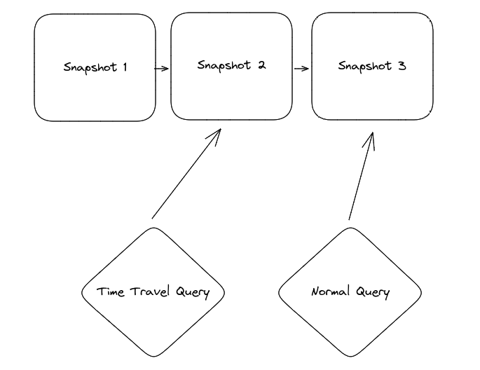

# Explore Apache Iceberg

## Table of Contents

- [Explore Apache Iceberg](#explore-apache-iceberg)
  - [Table of Contents](#table-of-contents)
  - [1. Introduction to Apache Iceberg](#1-introduction-to-apache-iceberg)
  - [2. Architecture of Apache Iceberg](#2-architecture-of-apache-iceberg)
    - [Data Layer](#data-layer)
    - [Metadata Layer](#metadata-layer)
    - [Iceberg Catalog](#iceberg-catalog)
  - [3. Apache Iceberg Features](#3-apache-iceberg-features)
    - [ACID Transactions](#acid-transactions)
    - [Partition Evolution](#partition-evolution)
    - [Hidden Partitioning](#hidden-partitioning)
    - [Row-Level Table Operations](#row-level-table-operations)
    - [Time-Travel](#time-travel)
    - [Version Rollback](#version-rollback)
    - [Scheme Evolution](#scheme-evolution)
  - [4. Getting Hands-On with Apache Iceberg](#4-getting-hands-on-with-apache-iceberg)
    - [4.1. Setting Up the Environment](#41-setting-up-the-environment)
    - [4.2. Lifecycle of Write and Read Queries](#42-lifecycle-of-write-and-read-queries)
      - [4.2.1. Write Queries in Apache Iceberg](#421-write-queries-in-apache-iceberg)
        - [Create Table](#create-table)
          - [Send Query to the Engine](#send-query-to-the-engine)
          - [Write Metadata File](#write-metadata-file)
          - [Update the Catalog File to Commit Changes](#update-the-catalog-file-to-commit-changes)
        - [Insert Query](#insert-query)
          - [Send Query to the Engine](#send-query-to-the-engine-1)
          - [Check the Catalog](#check-the-catalog)
          - [Write Data \& Metadata Files](#write-data--metadata-files)
          - [Update the Catalog File to Commit Changes](#update-the-catalog-file-to-commit-changes-1)
        - [MERGE Query](#merge-query)
      - [4.2.2. Read Queries in Apache Iceberg](#422-read-queries-in-apache-iceberg)
        - [SELECT Query](#select-query)
          - [Send Query to the Engine](#send-query-to-the-engine-2)
          - [Check the Catalog](#check-the-catalog-1)
          - [Get Information from the Metadata File](#get-information-from-the-metadata-file)
          - [Get Information from the Manifest List](#get-information-from-the-manifest-list)
          - [Get Information from the Manifest Files](#get-information-from-the-manifest-files)
        - [Time-travel Query](#time-travel-query)
  - [5. Optimizing the Performance of Iceberg Tables](#5-optimizing-the-performance-of-iceberg-tables)
    - [5.1. Compaction](#51-compaction)
    - [5.2. Sorting](#52-sorting)
    - [5.3. Partitioning](#53-partitioning)
    - [5.4. Copy-on-Write vs. Merge-on-read](#54-copy-on-write-vs-merge-on-read)
    - [5.5. Other Considerations](#55-other-considerations)

## 1. Introduction to Apache Iceberg

Apache Iceberg is an open-source data table format originally developed at Netflix to overcome challenges faced by existing data lake formats like [Apache Hive](https://hive.apache.org/). Boasting capabilities such as support for ACID transactions, time-travel, in-place schema, partition evolution, data versioning, incremental processing, etc., it offers a fresh perspective on open data lakes, enabling fast and efficient data management for large analytics workloads.

Thanks to all this, and especially thanks to its ability to handle partitions and data changes so well, Iceberg is becoming more and more popular, now adopted by many of the top data platform technologies such as Cloudera, Snowflake, Dremio, and so on.

## 2. Architecture of Apache Iceberg

Apache Iceberg has a tiered metadata structure which is key to how Iceberg provides high-speed queries for both reads and writes. Apache Iceberg was built upon three distinct layers: the Iceberg Catalog, the Metadata Layer, and the Data Layer.


### Data Layer

The data layer holds the actual data in the table, which is made up of two types of files:

- **Data files:** Stores the data in file formats such as Parquet or ORC.
- **Delete files:** Tracks records that still exist in the data files, but that should be considered as deleted.


### Metadata Layer

Apache Iceberg uses three tiers of metadata files which cover three different scopes:

- **Manifest files:** A subset of the snapshot, these files track the individual files in the data layer in the subset along with metadata for further pruning.
- **Manifest lists:** Defines a snapshot of the table and lists all the manifest files that make up that snapshot with metadata on the manifest files for pruning.
- **Metadata files:** Defines the table and tracks manifest lists, current and previous snapshots, schemas, and partition schemes.

### Iceberg Catalog

The catalog tracks a reference/pointer to the current metadata file. This is usually some store that can provide some transactional guarantees like a relational database (Postgres, etc.) or metastore (Hive, Project Nessie, Glue).

## 3. Apache Iceberg Features

Apache Iceberg’s unique architecture enables an ever growing number of features that go beyond just solving the challenges with Hive, but unlocking entirely new functionality for data lakes and data lakehouse workloads.

Below is a high level overview of key features of Apache Iceberg.

### ACID Transactions

Apache Iceberg uses techniques like optimistic concurrency control to enable ACID guarantees even when you have transactions being handled by multiple readers and writers. This way you can run transactions on your data lakehouse that either commit or fail and nothing in between. A pessimistic concurrency model to enable balancing locking considerations for a wider variety of use cases (e.g., ones in which there is a higher likelihood of update conflicts) is also coming in the future, at time of writing.

Concurrency guarantees are handled by the catalog as it is typically a mechanism that has built in ACID guarantees, This is what allows transactions on Iceberg tables to be atomic and provide correctness guarantees. If this didn’t exist, two different systems could have conflicting updates resulting in data loss.

### Partition Evolution

A big headache with data lakes prior to Apache Iceberg was dealing with the need to change the table’s physical optimization. Too often, when your partitioning needs to change the only choice you have is to rewrite the entire table and at scale that can get very expensive. The alternative is to just live with the existing partitioning scheme and sacrifice the performance improvements a better partitioning scheme can provide.

With Apache Iceberg you can update how the table is partitioned at any time without the need to re-write the table and all of its data. Since partitioning has everything to do with the metadata, the operations needed to make this change to your table’s structure are quick and cheap.


### Hidden Partitioning

Sometimes users don’t know how a table is physically partitioned, and frankly, they shouldn’t have to care. Often a table is partitioned by some timestamp field and a user wants to query by that field (e.g., get average revenue by day for the last 90 days). However, to a user, the most intuitive way to do that is to include a filter of event_timestamp >= DATE_SUB(CURRENT_DATE, INTERVAL 6 MONTH) . However, this will result in a full table scan because the table is actually partitioned by separate fields called event_year , event_month , and event_day because partitioning on a timestamp results in tiny partitions since the values are at the second, millisecond, or lower granularity.

This problem is resolved with how Apache Iceberg’s handles partitioning. Partitioning in Apache Iceberg comes in two parts, the column from which physical partitioning should be based on and an optional transform to that value including functions such as bucket, truncate, year, month, day and hour. The ability to apply a transform eliminates the need to create new columns just for partitioning. This results in more intuitive queries benefiting from partitioning as consumers will not need to add extra filter predicates to their queries on additional partitioning columns.


### Row-Level Table Operations

You can optimize the table’s row-level update patterns to take two forms: Copy-on-Write (COW) or Merge-on-Read. When using COW, for a change of any row in a given data file, the entire file is rewritten (with the row-level change made in the new file) even if a single record in it is updated. When using MOR, for any row-level updates, only a new file that contains the changes to the affected row which is reconciled on reads is written. This gives flexibility to speed-up heavy update and delete workloads.

### Time-Travel

Apache Iceberg provides immutable snapshots, so the information for the tables historical state is accessible allowing you to run queries on the state of the table at a given point in time in the past, or what’s commonly known as time-travel. This can help you in situations such as doing end-of-quarter reporting without the need for duplicating the table’s data to a separate location or for reproducing the output of a machine learning model as of a certain point in time.



### Version Rollback

Not only does Iceberg’s Snapshot isolation allow you query the data as it is, but to also revert the tables current state to any of those previous snapshots. So undoing mistakes is as easy as rolling back.


### Scheme Evolution

Tables change, whether that means adding/removing a column, renaming a column, or changing a column’s data type. Regardless of how your table needs to evolve, Apache Iceberg gives you robust schema evolution features.

## 4. Getting Hands-On with Apache Iceberg

### 4.1. Setting Up the Environment

*Prerequisite: You must have Docker installed. If you don’t, you can [download and install it here](https://docs.docker.com/get-docker/).*

To keep things as simple as possible, we use this self-contained Docker container which has everything you need:

```bash
docker pull alexmerced/spark3-3-iceberg0-14
```

We then open up the container in interactive mode:

```bash
docker run -it alexmerced/spark3-3-iceberg0-14
```

This Docker container comes with a simple command to open up SparkSQL configured for Iceberg:

```bash
iceberg-init
```


Now we are ready to test Iceberg.

### 4.2. Lifecycle of Write and Read Queries

#### 4.2.1. Write Queries in Apache Iceberg

The write process in Apache Iceberg involves a series of steps that enable query engines to efficiently insert and update data. When a write query is initiated, it is sent to the engine for parsing. The catalog is then consulted to ensure consistency and integrity in data and to write data as per the defined partition strategies. The metadata and data files are then written based on the query. Finally, the catalog file is updated to reflect the latest metadata, enabling subsequent read operations to access the most up-to-date version of the data.

##### Create Table

Let us first create an Iceberg table and understand the process underneath. Here is an example query to create a table called orders with four columns. This table is partitioned at the hour granularity of the order_ts field.

```sql
CREATE TABLE iceberg.db1.orders (
    order_id BIGINT,
    customer_id BIGINT,
    order_amount DECIMAL(10, 2),
    order_ts TIMESTAMP
)
USING ICEBERG;
```

###### Send Query to the Engine

First, the query is sent to the query engine to parse it on their end. Then, since it is a CREATE statement, the engine will start creating and defining the table.

###### Write Metadata File

At this point, the engine starts creating a metadata file v1.metadata.json in the data lake file system to store information about the table. A generic form of the URL of the path looks something like this - ://path/to/warehouse/db1/table1/metadata/v1.metadata.json. Based on the information on the table path, i.e. /path/to/warehouse/db1/table1 , the engine writes the metadata file. It then defines the schema of the table orders by specifying the columns, data types, etc. and stores it in the metadata file. And finally it assigns a unique identifier to the table, i.e. the table-uuid . Once the query executes successfully, the metadata file v1.metadata.json is written to the data lake file storage.

```output
|
`-- warehouse
    `-- db1
        `-- orders
            `-- metadata
                |-- v1.metadata.json
                `-- version-hint.text
```

If you inspect the metadata file, you will see the schema of the defined table along with the partition specification as seen below.

```json
{
  "format-version" : 1,
  "table-uuid" : "fca4f88e-1bc1-4055-8b2e-37bb7ef0363b",
  "location" : "/home/docker/warehouse/db1/orders",
  "last-updated-ms" : 1700060798886,
  "last-column-id" : 4,
  "schema" : {
    "type" : "struct",
    "schema-id" : 0,
    "fields" : [ {
      "id" : 1,
      "name" : "order_id",
      "required" : false,
      "type" : "long"
    }, {
      "id" : 2,
      "name" : "customer_id",
      "required" : false,
      "type" : "long"
    }, {
      "id" : 3,
      "name" : "order_amount",
      "required" : false,
      "type" : "decimal(10, 2)"
    }, {
      "id" : 4,
      "name" : "order_ts",
      "required" : false,
      "type" : "timestamptz"
    } ]
  },
  "current-schema-id" : 0,
  "schemas" : [ {
    "type" : "struct",
    "schema-id" : 0,
    "fields" : [ {
      "id" : 1,
      "name" : "order_id",
      "required" : false,
      "type" : "long"
    }, {
      "id" : 2,
      "name" : "customer_id",
      "required" : false,
      "type" : "long"
    }, {
      "id" : 3,
      "name" : "order_amount",
      "required" : false,
      "type" : "decimal(10, 2)"
    }, {
      "id" : 4,
      "name" : "order_ts",
      "required" : false,
      "type" : "timestamptz"
    } ]
  } ],
  "partition-spec" : [ ],
  "default-spec-id" : 0,
  "partition-specs" : [ {
    "spec-id" : 0,
    "fields" : [ ]
  } ],
  "last-partition-id" : 999,
  "default-sort-order-id" : 0,
  "sort-orders" : [ {
    "order-id" : 0,
    "fields" : [ ]
  } ],
  "properties" : {
    "owner" : "docker"
  },
  "current-snapshot-id" : -1,
  "refs" : { },
  "snapshots" : [ ],
  "snapshot-log" : [ ],
  "metadata-log" : [ ]
}
```

This is the current state of the table, i.e. you have created a table but it is an empty table with no records. In Iceberg terms, this is called a snapshot.

An important thing to note here is that since, to this point, you haven’t inserted any records, there is no actual data in the table, so there are no data files in your data lake. Therefore, the snapshot doesn’t point to any manifest list; hence, there are no manifest files.

###### Update the Catalog File to Commit Changes

Finally, the engine updates the current metadata pointer to point to the v1.metadata.json file in the catalog file version-hint.text , as this is the present state of our table.


##### Insert Query

Now, let us insert some records into the table and understand how things work underneath. We have created a table called orders with 4 columns. For this demonstration, we will input the following values into the table: order_id: 123 , customer_id: 456 , order_amount: 36.17 , order_ts: timestamp(now()) . Here is the query.

```sql
INSERT INTO iceberg.db1.orders VALUES (
    123,
    456,
    36.17,
    timestamp(now())
);
```

###### Send Query to the Engine

The query is sent to the query engine to parse it. Since this is an INSERT statement, the engine needs information about the table such as its schema to start with query planning.

###### Check the Catalog

First, the query engine makes a request of the catalog to determine the location of the current metadata file and then reads it. Because we are using the Hadoop catalog, the engine will read the /orders/metadata/version-hint.txt file and see that the contents of the file is a single integer 1. Because of this and leveraging logic from the catalog implementation, the engine knows the current metadata file location is located at /orders/metadata/v1.metadata.json , the file our previous CREATE TABLE operation created. So, the engine will read this file. Although the engine’s motivation, in this case, is inserting new data files, it still interacts with the catalog primarily for two reasons.

- The engine needs to understand the current schema of the table to adhere to it.
- Learn about the partitioning scheme to organize data accordingly while writing.

###### Write Data & Metadata Files

After the engine learns about the table schema and the partitioning scheme, it starts writing the new data files and the related metadata files. Here’s what happens in this process.

The engine first writes the records as a Parquet data file. Additionally, if a sort order is defined for the table, records will be sorted before being written into the data file. This is what it might look like in the file system.

```output
|
`-- warehouse
    `-- db1
        `-- orders
            |-- data
            |   `-- 00000-0-e1aa6fba-2503-408d-85b3-860840e98e18-00001.parquet
```

After writing the data file, the engine creates a manifest file. This manifest file is given information about the path of the actual data file the engine created. In addition, the engine also writes statistical information, such as upper and lower bounds of a column, null value counts, etc., in the manifest file, which are highly beneficial for the query engine to prune files and provide the best performance. The engine computes this information while processing the data it’s going to write, so this is a relatively lightweight operation, at least compared to a process starting from scratch having to compute the statistics. The manifest file is written as an .avro file in the storage system.

```output
|
`-- warehouse
    `-- db1
        `-- orders
            |-- metadata
            |   `-- 62acb3d7-e992-4cbc-8e41-58809fcacb3e.avro
```

Next, the engine creates a manifest list to keep track of the manifest file. If existing manifest files are associated with this snapshot, those will also be added to this new manifest list. The engine writes this file to the data lake with information such as the manifest file’s path, the number of data files/rows added or deleted, and statistics about partitions, such as the lower and upper bounds of the partition columns. Again, the engine already has all of this information, so it’s a lightweight operation to have these statistics. This information helps read queries exclude any non-required manifest files, facilitating faster queries.

```output
|
`-- warehouse
    `-- db1
        `-- orders
            |-- metadata
            |   `-- snap-8333017788700497002-1-4010cc03-5585-458c-9fdc-188de318c3e6.avro
```

Finally, the engine creates a new metadata file, v2.metadata.json , with a new snapshot, s1, by considering the existing metadata file v1.metadata.json (previously current) while keeping track of the previous snapshot, s0. This new metadata file includes information about the manifest list created by the engine with details such as the manifest list file path, snapshot id, summary of operation, etc. Also, the engine makes a reference that this manifest list (or snapshot) is now the current one.

```output
|
`-- warehouse
    `-- db1
        `-- orders
            |-- data
            |   `-- 00000-0-e1aa6fba-2503-408d-85b3-860840e98e18-00001.parquet
            `-- metadata
                |-- 62acb3d7-e992-4cbc-8e41-58809fcacb3e.avro
                |-- snap-8333017788700497002-1-4010cc03-5585-458c-9fdc-188de318c3e6.avro
                |-- v1.metadata.json
                |-- v2.metadata.json
                `-- version-hint.text
```

###### Update the Catalog File to Commit Changes

Now, the engine goes to the catalog again to ensure no other snapshots were committed while this INSERT operation was being run. By doing this validation, Iceberg guarantees no interference in operations in a scenario where multiple writers write data concurrently. Iceberg makes sure that the one writing the data first will get committed first, and any conflicted write operation will go back to the previous steps and re-attempt until the write is successful or fails.

In the end, the engine atomically updates the catalog to refer to the new metadata v2.metadata.json , which now becomes the current metadata file.


##### MERGE Query

#### 4.2.2. Read Queries in Apache Iceberg

##### SELECT Query

###### Send Query to the Engine

###### Check the Catalog

###### Get Information from the Metadata File

###### Get Information from the Manifest List

###### Get Information from the Manifest Files

##### Time-travel Query

## 5. Optimizing the Performance of Iceberg Tables

### 5.1. Compaction

### 5.2. Sorting

### 5.3. Partitioning

### 5.4. Copy-on-Write vs. Merge-on-read

### 5.5. Other Considerations
